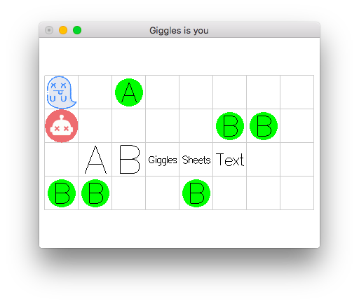

# Giggles is You

Hi! I'm reimplementing the amazing puzzle game [Baba is You](https://hempuli.com/baba/) in Haskell. I'm doing it [live on twitch](https://twitch.tv/gelisam), one hour at a time, one hour per week.

This is probably my most beginner-friendly Haskell project, so if you catch me live, please don't be afraid to ask beginner questions or questions which have probably been asked before! My goal is not to have a Baba is You implementation in Haskell, my goal is to teach you how to implement a small game in Haskell :)
